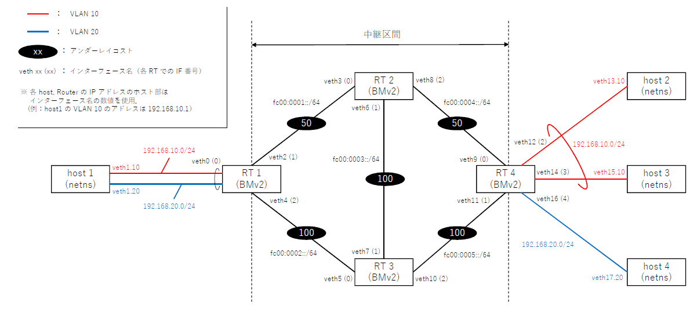

# 概要

SRv6 ([RFC8986](https://datatracker.ietf.org/doc/html/rfc8986)) の L2VPN 機能（End.DX2, End.DX2V, End.DT2U, End.DT2M) およびカプセル化機能(H.Encaps) をそれぞれ実装し ether over v6 with SRv6 の簡単なデモを行います．特に，エンドポイントを指定する End, End.X も実装し L2VPN の中継区間にてトラヒックエンジニアリングも行います．[p4-guide](https://github.com/jafingerhut/p4-guide)等を参照し P4 開発環境が構築済みであることを前提とします．デモ実施手順は大きく下記となります．

1. P4 プログラムのコンパイル
2. デモ環境構築
3. スイッチエミュレータ（BMv2）起動
4. テーブルエントリ設定（一部項目の手動入力）
5. C/P プログラム実行（エントリ登録等）
6. 疎通確認，キャプチャ確認

なお，今回のデモでは BMv2 を 4 台同時に起動するため，仮想マシン等で動作させる場合 VM のスペックによっては動作が安定しない可能性があります．
以降で記載するデモ動作確認はコア数 ４，メモリ 8 GB，ディスク容量 40G の VM で行っています．

# デモ実施手順

本 repository を clone した後，下記のように P4 プログラムをコンパイルします．コンパイル後，カレントディレクトリに p4info.txt と main.json が生成されていることを確認してください．

```sh
> cd p4-practice/srv6-l2vpn
> p4c -a v1model -b bmv2 --p4runtime-files p4info.txt main.p4
> ls
p4info.txt  main.json ...
```

続いてデモ環境を構築します．今回は host(netns) と Router（BMv2）をそれぞれ 4 台ずつ起動して下記のような環境を構築します．



まず，下記のようにインターフェース設定および host 作成を行います．なお ```behavioral-model``` ディレクトリの場所はインストール時のディレクトリに依存するため注意してください．

```sh
> sudo <path to behavioral-model>/tools/veth_setup.sh
> sudo setup.sh -c
```

次に，下記のように各 Router(BMv2) を起動します．なお，1台毎に新規のターミナルを起動して実行してください．

- RT1 の起動
  - ```sudo simple_switch_grpc --no-p4 -i 0@veth0 -i 1@veth2 -i 2@veth4 -- --grpc-server-addr 0.0.0.0:50051```

- RT2 の起動
  - ```sudo simple_switch_grpc --no-p4 -i 0@veth3 -i 1@veth6 -i 2@veth8 --thrift-port 9091 -- --grpc-server-addr 0.0.0.0:50052```

- RT3 の起動
  - ``` sudo simple_switch_grpc --no-p4 -i 0@veth5 -i 1@veth7 -i 2@veth10 --thrift-port 9092 -- --grpc-server-addr 0.0.0.0:50053```

- RT4 の起動
  - ```sudo simple_switch_grpc --no-p4 -i 0@veth9 -i 1@veth11 -i 2@veth12 -i 3@veth14 -i 4@veth16 --thrift-port 9093 -- --grpc-server-addr 0.0.0.0:50054```

以上でデモ環境の構築は完了です．

今回のデモは 2 種類の VLAN を中継区間で仮想的に接続する状況を想定します．
VLAN 10 では End.DT2U/End.DT2M をそれぞれ利用してユーザフレームの宛先 MAC アドレスに基づく Switching，あるいは（対向PEにおける）BUM トラヒックのフラッディングを行います．VLAN 20 では End.DX2V を利用してユーザフレームの VLAN ID より出力ポートを決定します．
なお，簡単のため host1 方向のトラヒックは全て End.DX2 で転送することとします．

host1 方向のトラヒックについて，中継区間では VLAN 10 のトラヒックは RT4 -> RT3 -> RT1 を通過するよう RT3 の (RT1向きの) End.X を RT4 にてインサートして転送し，また VLAN 20 のトラヒックは RT4 -> RT3 -> RT2 -> RT1 を通過するよう RT3 および RT2 の End をそれぞれ RT4 にてインサートして転送します．
なお，アンダーレイのコスト設計は RT1 <-> RT2 <-> RT4 が最短路となるよう設計されているものとします．

トラヒックパターン毎のヘッダ構成および転送の様子をそれぞれ [figures ディレクトリ](./figures) に格納しましたので参考として併せてご参照ください．

RT 4 にて対向 host の MAC アドレスに応じた Switching を行うために各 host の MAC アドレスをテーブルエントリに指定する必要があります．
```config-RT4.json``` の下記記載箇所に host2, host3 の MAC アドレスをそれぞれ入力します．

```json:config-RT4.json

    ...

    {
      "table": "SwitchIngress.l2_forward",
      "match": {
        "meta.rd": 0,
        "meta.ethernet_dst_addr": "host2's MAC addr." <- host2 の MAC アドレスを入力
      },
      "action_name": "SwitchIngress.switching",
      "action_params": {
        "port": 2
      }
    },
    {
      "table": "SwitchIngress.l2_forward",
      "match": {
        "meta.rd": 0,
        "meta.ethernet_dst_addr": "host3's MAC addr." <- host3 の MAC アドレスを入力
      },
      "action_name": "SwitchIngress.switching",
      "action_params": {
        "port": 3
      }
    },

    ...
```

config の入力後に下記のように C/P プログラムを実行すると各 Router への設定投入等を行い，入力待ちの状態となります．

```
> go run main.go
2021/07/15 18:23:04 INFO[RT1]: P4Info/ForwardingPipelineConfig/EntryHelper is successfully loaded.
2021/07/15 18:23:04 INFO[RT1]: StreamChannel is successfully established.
2021/07/15 18:23:04 INFO[RT1]: MasterArbitrationUpdate successfully done.
2021/07/15 18:23:04 INFO[RT1]: SetForwardingPipelineConfig successfully done.
2021/07/15 18:23:04 INFO[RT1]: Table Entries are successfully written.
2021/07/15 18:23:07 INFO[RT2]: P4Info/ForwardingPipelineConfig/EntryHelper is successfully loaded.
2021/07/15 18:23:07 INFO[RT2]: StreamChannel is successfully established.
2021/07/15 18:23:07 INFO[RT2]: MasterArbitrationUpdate successfully done.
2021/07/15 18:23:07 INFO[RT2]: SetForwardingPipelineConfig successfully done.
2021/07/15 18:23:07 INFO[RT2]: Table Entries are successfully written.
2021/07/15 18:23:10 INFO[RT3]: P4Info/ForwardingPipelineConfig/EntryHelper is successfully loaded.
2021/07/15 18:23:10 INFO[RT3]: StreamChannel is successfully established.
2021/07/15 18:23:10 INFO[RT3]: MasterArbitrationUpdate successfully done.
2021/07/15 18:23:10 INFO[RT3]: SetForwardingPipelineConfig successfully done.
2021/07/15 18:23:10 INFO[RT3]: Table Entries are successfully written.
2021/07/15 18:23:13 INFO[RT4]: P4Info/ForwardingPipelineConfig/EntryHelper is successfully loaded.
2021/07/15 18:23:13 INFO[RT4]: StreamChannel is successfully established.
2021/07/15 18:23:13 INFO[RT4]: MasterArbitrationUpdate successfully done.
2021/07/15 18:23:13 INFO[RT4]: SetForwardingPipelineConfig successfully done.
2021/07/15 18:23:13 INFO[RT4]: Table Entries are successfully written.
2021/07/15 18:23:13 INFO[RT4]: MulticastGroup Entries are successfully written.
2021/07/15 18:23:16 ============================================================
2021/07/15 18:23:16  type "quit[Enter]" if you want to terminate this program 
2021/07/15 18:23:16 ============================================================
```

C/P プログラムを終了する場合は "quit" を入力し Enter を押下してください．
下記のように RT1 ~ RT4 までの C/P がそれぞれ終了します．

```
quit[Enter]
2021/07/15 18:47:37 INFO: Shutdown (wait for a few seconds)
2021/07/15 18:47:38 INFO[RT3]: is going to down
2021/07/15 18:47:38 INFO[RT2]: is going to down
2021/07/15 18:47:38 INFO[RT1]: is going to down
2021/07/15 18:47:38 INFO[RT4]: is going to down
```

以上で環境構築および設定投入まで完了した状態となり，host から ping を打つと疎通します．
例えば，VLAN 20 における疎通確認は下記のように実施します．

```
> sudo ip netns exec host1 ping 192.168.20.17
PING 192.168.20.17 (192.168.20.17) 56(84) bytes of data.
64 bytes from 192.168.20.17: icmp_seq=1 ttl=64 time=15.2 ms
64 bytes from 192.168.20.17: icmp_seq=2 ttl=64 time=11.4 ms
64 bytes from 192.168.20.17: icmp_seq=3 ttl=64 time=8.86 ms
64 bytes from 192.168.20.17: icmp_seq=4 ttl=64 time=7.66 ms
64 bytes from 192.168.20.17: icmp_seq=5 ttl=64 time=10.5 ms
64 bytes from 192.168.20.17: icmp_seq=6 ttl=64 time=9.32 ms
64 bytes from 192.168.20.17: icmp_seq=7 ttl=64 time=9.70 ms
```

各 VLAN について疎通確認時の各インターフェースのキャプチャデータを ```capture``` ディレクトリに格納しているので良ければ参照ください．
中継区間にて SRv6 でカプセル化が行われていることを確認出来ます．

デモの実施を終了する場合は "quit\[Enter\]" で C/P プログラムを停止した後 ctrl+C で各 BMv2 を終了し，下記を実行して host やインターフェース設定を削除してください．

```
> sudo setup.sh -d
> sudo behavioral-model/tools/veth_teardown.sh
```

<!--

# 制約事項

今回の実装では host2 と host3 間での疎通性がありません．これは host2 or host3 発のパケットが対地宛かどうか（ = SRv6 でカプセル化して対地まで転送すべきか，あるいは自身の保持する L2 table に基づいて switching すべきか）を判別出来ないため，特定の VLAN からの着パケットを SRv6 でカプセル化して対向 CE まで転送する実装としているためです．まず L2 table で switching して hit しなければカプセル化して転送，という実装も考えましたが，同一のパイプライン処理（例：Ingress 処理）の内部では table を一度しか適用出来ないため，カプセル化する前に switching 判定を行うと End.DT2U の場合（```srv6_func.appliy()``` 以後に switching 判定を行う場合）と矛盾するため実装が出来ませんでした,,,,,

-->